# CI/CD Pipeline Documentation


## Overview

This project uses **GitHub Actions** for Continuous Integration (CI) to automatically run tests on every push and pull request.

## Current Setup

### ✅ Continuous Integration (CI)

**Workflow File:** [.github/workflows/ci.yml](.github/workflows/ci.yml)

**Triggers:**
- Push to `main` or `develop` branches
- Pull requests to `main` or `develop` branches

**What Gets Tested:**

#### 1. Backend Tests (25 tests)
- **Framework:** Django TestCase
- **Coverage:**
  - 8 Model tests (AnalysisJob, UploadedFile, AnalysisResult)
  - 14 API endpoint tests (Upload, Status, Details, Results, Bacteria)
  - 3 Integration tests (Complete workflow, Job isolation)
- **Runtime:** ~5 seconds
- **Python Version:** 3.11

#### 2. Frontend Tests (17 tests)
- **Framework:** Vitest + React Testing Library
- **Coverage:**
  - Component tests (UploadForm, StatusDisplay, etc.)
  - Page tests (Home, JobDetail)
  - Utility tests (API client, formatting)
- **Runtime:** ~3 seconds
- **Node Version:** Uses Bun (latest)

### CI Pipeline Flow

```mermaid
graph LR
    A[Push/PR] --> B[Checkout Code]
    B --> C[Backend Tests]
    B --> D[Frontend Tests]
    C --> E{All Pass?}
    D --> E
    E -->|Yes| F[✅ Success]
    E -->|No| G[❌ Failure]
```



### Test Results

```bash
Backend:  25/25 tests passing ✅
Frontend: 17/17 tests passing ✅
Total:    42/42 tests passing ✅
```

## Viewing CI Results

### On GitHub
1. Go to your repository on GitHub
2. Click "Actions" tab
3. See all workflow runs

### Status Badge
The README shows real-time CI status:
- ✅ Green = All tests passing
- ❌ Red = Tests failing
- 🟡 Yellow = Tests running

### In Pull Requests
- CI status shows automatically
- Prevents merging if tests fail
- Shows which tests failed

## Local Testing

Before pushing, run tests locally:

### Backend Tests
```bash
cd backend/microbiome-backend
python manage.py test
```

### Frontend Tests
```bash
cd frontend
bun test
```

### Both at Once
```bash
# Backend
cd backend/microbiome-backend && python manage.py test && cd ../..

# Frontend
cd frontend && bun test && cd ..
```

## CI Configuration Details

### Backend Job
```yaml
- Python 3.11
- Install dependencies from requirements.txt
- Run Django tests with verbosity=2
- Cache pip dependencies for speed
```

### Frontend Job
```yaml
- Bun (latest)
- Install dependencies from bun.lockb
- Run Vitest tests
- Cache node_modules for speed
```

## Performance Optimizations

- **Caching:** Dependencies cached between runs
- **Parallel Jobs:** Backend and frontend run simultaneously
- **Fast Runners:** GitHub-hosted Ubuntu runners
- **Minimal Output:** Only show failures by default

## Troubleshooting

### CI Failing Locally Passing?

**Check environment differences:**
```bash
# Different Python version?
python --version  # CI uses 3.11

# Different dependencies?
pip freeze  # Compare with requirements.txt

# Database issues?
# CI uses in-memory SQLite
```

### View CI Logs

1. Go to Actions tab on GitHub
2. Click the failing workflow
3. Click the failing job
4. Expand the step that failed

### Common Issues

| Issue | Solution |
|-------|----------|
| `ModuleNotFoundError` | Add to requirements.txt/package.json |
| Database locked | Normal for concurrent tests |
| Test timeout | Increase timeout or optimize test |
| Import error | Check file paths are correct |

## Branch Protection

### Recommended Settings
```
Settings → Branches → Add rule:
- Branch name pattern: main
- ✅ Require status checks to pass
- ✅ Require branches to be up to date
- Select: backend-tests, frontend-tests
```

This prevents merging failing code!

## Future Enhancements

### 🔄 Continuous Deployment (CD)
```yaml
# After tests pass:
- Build Docker images
- Push to registry
- Deploy to production
- Run smoke tests
```

### 📊 Test Coverage Reports
```yaml
- Generate coverage.py report
- Upload to Codecov
- Show coverage badge
```

### 🔒 Security Scanning
```yaml
- Run safety check (Python)
- Run npm audit (JavaScript)
- Scan Docker images
```

### ⚡ Performance Testing
```yaml
- Load testing with Locust
- Frontend performance with Lighthouse
- Database query analysis
```

## Metrics

### Current Performance
- **Total CI Time:** ~3-4 minutes
- **Backend Tests:** ~30 seconds
- **Frontend Tests:** ~20 seconds
- **Setup Time:** ~2-3 minutes (with caching)

### Success Rate
- Target: >95% green builds
- Current: Monitor in Actions tab

## Best Practices

### ✅ Do
- Run tests locally before pushing
- Keep tests fast (<10 seconds each)
- Fix failing tests immediately
- Add tests for new features
- Use meaningful commit messages

### ❌ Don't
- Skip CI on failing tests
- Commit broken code
- Push without testing
- Ignore CI failures
- Delete .github/workflows files

## Resources

- [GitHub Actions Docs](https://docs.github.com/en/actions)
- [Django Testing](https://docs.djangoproject.com/en/5.1/topics/testing/)
- [Vitest Docs](https://vitest.dev/)
- [Backend Testing Guide](../backend/microbiome-backend/TESTING.md)
- [Frontend Testing Guide](../frontend/TESTING.md)

## Status

✅ **CI Pipeline Active**
- Backend tests: Automated
- Frontend tests: Automated
- Status badge: Live
- Branch protection: Recommended

🔜 **Coming Soon**
- Continuous Deployment (CD)
- Test coverage reporting
- Security scanning
- Performance monitoring
